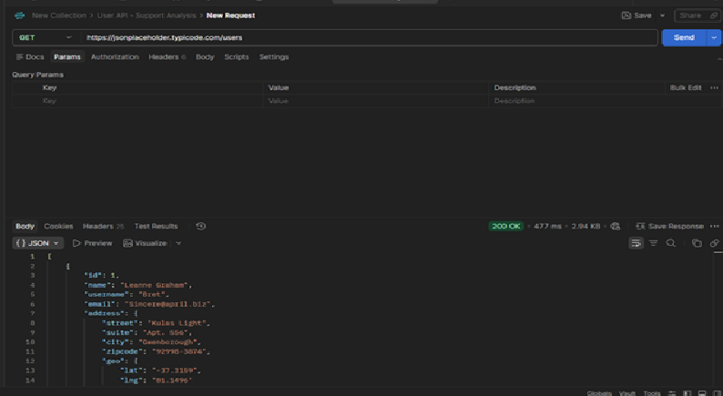
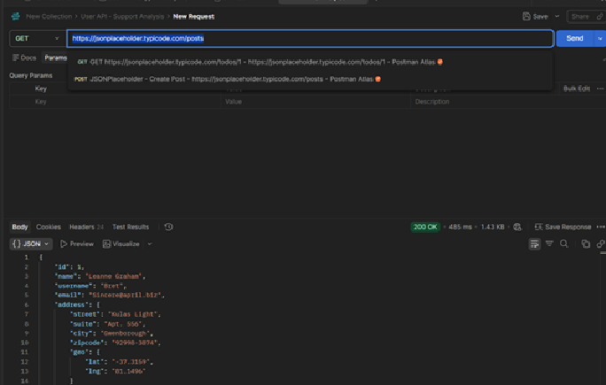
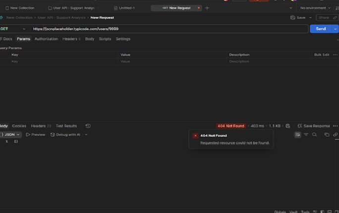
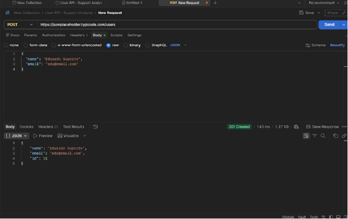
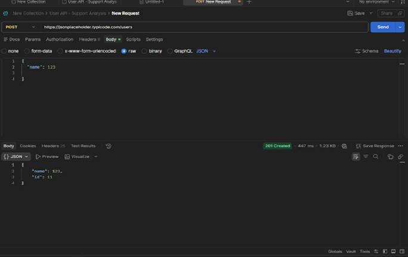
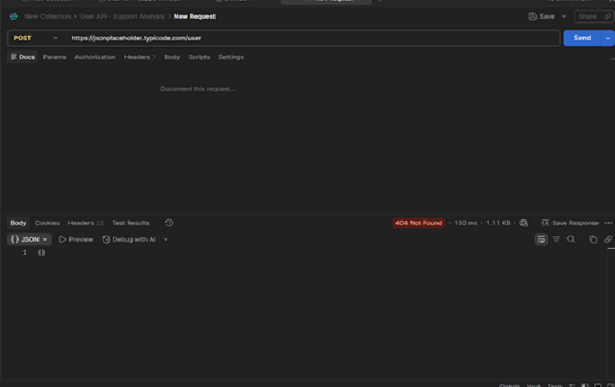
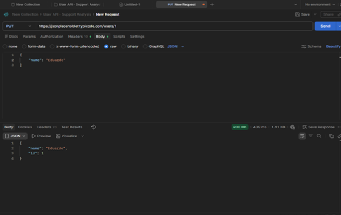
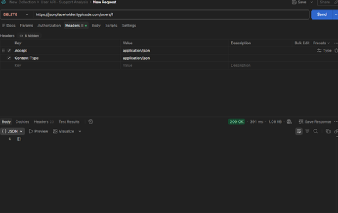

# API Testing com Postman

Projeto prático desenvolvido para aplicar conceitos de testes de APIs REST utilizando o **Postman**, realizando operações de CRUD em uma API pública e documentando os resultados obtidos.

---

# Objetivo

Demonstrar conhecimentos em:

- Consumo de APIs REST
- Testes de endpoints HTTP
- Operações CRUD
- Interpretação de códigos de status HTTP
- Organização de Collections no Postman
- Análise de respostas da API
- Documentação de evidências de testes

---

# Tecnologias utilizadas

- Postman
- API REST
- JSON
- JSONPlaceholder

---

# API utilizada

Foi utilizada a API pública **JSONPlaceholder**, amplamente utilizada para estudos e testes de integração.

Base URL:

```text
https://jsonplaceholder.typicode.com
```

---

# Funcionalidades testadas

| Método | Endpoint | Objetivo | Resultado |
|---------|----------|----------|-----------|
| GET | /users | Listar usuários | ✅ 200 OK |
| GET | /users/1 | Buscar usuário existente | ✅ 200 OK |
| GET | /users/9999 | Buscar usuário inexistente | ❌ 404 Not Found |
| POST | /users | Criar usuário | ✅ 201 Created |
| POST | Dados inválidos | Avaliar validação da API | ⚠️ Aceitou dados inválidos |
| PUT | /users/1 | Atualizar usuário | ✅ 200/201* |
| DELETE | /users/1 | Remover usuário | ✅ 200 OK |

> **Observação:** A JSONPlaceholder é uma Fake API e simula as operações sem persistir alterações reais.

---

# Estrutura do projeto

```
📂 collection/
 └── postman_collection.json

📂 docs/
 ├── get-users-200.png
 ├── get-user-1-200.png
 ├── get-users-9999-404.png
 ├── post-create-users-201.png
 ├── users-name-int-201.png
 ├── not-found-404.png
 ├── put-users-201.png
 └── delete-200.png

README.md
```

---

# Evidências dos testes

## ✅ GET /users → 200 OK



Lista de usuários retornada com sucesso.

---

## ✅ GET /users/1 → 200 OK



Retorno de um usuário específico.

---

## ❌ GET /users/9999 → 404 Not Found



Validação de consulta para um usuário inexistente.

---

## ✅ POST /users → 201 Created



Criação de usuário realizada com sucesso.

---

## ⚠️ POST com dado inválido



Foi enviado um valor numérico para o campo **name**, porém a API retornou **201 Created**.

### Análise

Como a **JSONPlaceholder** é uma API destinada apenas para testes, ela não realiza validações de regras de negócio.

Em um ambiente de produção, o comportamento esperado seria o retorno de um erro **400 Bad Request**, indicando que o tipo do dado enviado é inválido.

Essa observação demonstra a importância de validar respostas da API e identificar possíveis riscos durante testes.

---

## ❌ Endpoint inexistente → 404



Teste realizado para validar o comportamento diante de uma rota inexistente.

---

## ✅ PUT /users/1



Atualização realizada com sucesso.

---

## ✅ DELETE /users/1



Usuário removido com sucesso.

---

# Collection

A Collection do Postman está disponível na pasta:

```
postman/ New Collection.postman_collecion.json
```

---

# Como executar

1. Clone este repositório.

```bash
git clone https://github.com/suematsu-09/api-postman-project
```

2. Abra o Postman.

3. Importe a Collection localizada na pasta **collection**.

4. Execute as requisições individualmente ou utilizando o Collection Runner.

---

# Aprendizados

Durante este projeto foram praticados os seguintes conceitos:

- Consumo de APIs REST
- Métodos HTTP (GET, POST, PUT e DELETE)
- Validação de códigos de status HTTP
- Testes de endpoints
- Organização de Collections no Postman
- Análise crítica dos resultados retornados pela API
- Documentação de evidências de testes

---

# Próximas melhorias

- Implementação de testes automatizados utilizando `pm.test()`
- Validação do tempo de resposta
- Uso de variáveis de ambiente
- Execução automatizada pelo Collection Runner
- Geração de relatórios de execução
